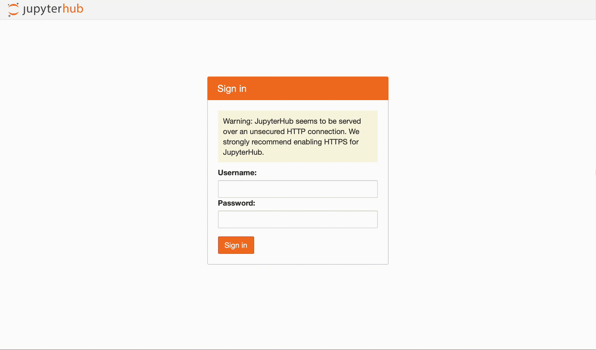
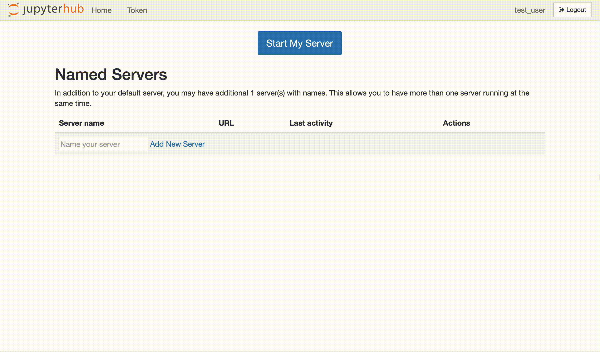

# user-manual

## 1 Jupyter Hub

### 1.1 Login

If you have been invited to use our compute servers, you have also been provided with `<user-name>` and `<ip-address>`. 

*1. Enter `http://<ip-adress>` in your browser to access the JupyterHub login page. Note that this page can only be accessed from within the university network or via virtual private network (VPN).*

*2. Enter your `<user-name>`.*

*3. Enter your password

### 1.2 Starting a Jupyter Server

... also named servers

### 1.3 Selecting an Environment

## 2 Jupyter Server

In this chapter, we will describe all of the building blocks that make up your Jupyter Server environment. 

### 2.1 User Interface Options

You are provided with two user interface options, Jupyter Lab and Jupyter Notebook. 

#### 2.1.1 Jupyter Lab (default)

The default user interface for the jupyter server is the [Jupyter Lab](https://jupyterlab.readthedocs.io/en/latest/), the url being `http://<ip-adress>/user/<user-name>/lab`. 

The Jupyter Lab user interface gives you all functionality that you could possible need in one single browser tab. On the left-hand side, you can find `file browser`, `running kernels`, `table of contents` (for an opened notebook), and the `extension manager`. On the right-hand side, you can find `property inspector` and the `debugging tool`. We may use the `kernel` tab to interrupt (`interrupt kernel`), shut down (`shut down kernel`), or restart (`restart kernel`) the selected kernel, meaning the kernel that is underlying the notebook or console that you are currently interacting with. We may use the `file` tab to log out (`log out`), or to go back to the Jupyter Hub (`hub control panel`) from where we can start and stop all of our Jupyter Server instances. 

The Jupyter Lab user inteface allows for different ways of running your code. Both `notebook` and `console` can be used for interactive programming, use the `notebook` runtime if you want to extend your code with markdown (see chapter 3.1.1). The `terminal` is less convenient, but it plays an important role when facing long-running jobs (see chapter 3.1.2). 

The Jupyter Lab user interface allows you to open and display a variety of text file formats (.py, .txt, .csv, .json, ...). This can be especially useful if you are trying to display a large .csv file that you would otherwise never be able to fit into memory. 

#### 2.1.2 Jupyter Notebook

The alternative user interface for the jupyter server is the [Jupyter Notebook](https://jupyter-notebook.readthedocs.io/en/latest/), the url being `http://<ip-adress>/user/<user-name>/tree`. You can simply switch user interface by changing `/lab` to `/tree`. Note, however, that this switch will not persist when reloading the page, and that we strongly advise you to use Jupyter Lab.  

The Jupyter Notebook user interface is much more light-weight. The `Files` tab allows you to browse, upload, create, and delete files (including notebooks). The `Running` tab allows you to monitor and shutdown running notebooks and terminals. 

### 2.2 Kernel options

You are provided with one or more kernel options, the default being Python. Please understand that, in terms of maintenance, we will not guarantee other options besides Python. 

#### 2.2.1 Python

#### 2.2.2 Other

With some image options (`data-science`, ...), you will also have access to other types of kernels such as [R](...) or [Julia](...). 

### 2.3 Resource options

#### 2.3.1 CPU
#### 2.3.2 Memory
#### 2.3.3 GPU
#### 2.3.4 Storage

### 2.3 Storage options

#### 2.3.1 User storage
#### 4.2.1 `read_only`
#### 4.2.2 `temp`

## 3 Workflow

Here, we describe steps for Python. 

> Note that any changes made to the environment will not persist after a restart, given that it is rebuilt every time from a docker image. The data in your user storage, however, *will* persist. 

### 3.1 Runtime options

### 3.1.1 Prototyping via notebook or console

### 3.1.2 Long-running jobs via terminal

... prevent culling
... describe behavior before shutdown
... always write to file

### 3.2 Organization options

#### 3.2.1 Scripting

#### 3.2.2 Modules

### 3.3 Important steps

#### 3.3.1 **Request resources** <--- lieber separaten Punkt draus machen

#### 3.3.2 Import modules

#### 3.3.3 Load input data
... see also 4.1 I/O

#### 3.3.4 Perform computations
... refer to 4.2 Compute

#### 3.3.5 Monitor computations

#### 3.3.5 Save output data
... results

## 4 Optimized Python

### 4.1 I/O

use datatable settings to prevent using all threads!

#### 4.1.1 Reading data

... datatable
`dt.fread().to_pandas()`
dt.iread()

#### 4.1.2 Writing
`dt.Frame(df).to_csv(path, compression="gzip")`

### 4.2 Compute

#### 4.1.1 Naïve approach via multiple kernels

#### 4.1.2 Multi-threading and multi-processing

#### 4.1.3 GPU-enabled Python

### 4.3 Memory

#### 4.3.1 Generator for larger-than-memory data

## 5 Where to go from here?

